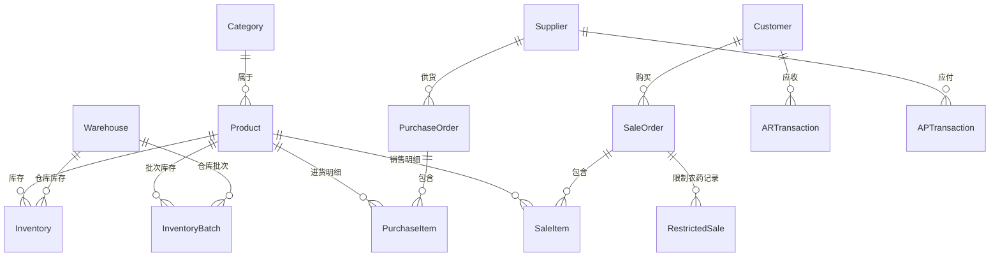

# SKILL.md — 农资店管理系统开发技能

> 编写该农资店项目代码时的操作手册。开始任何编码工作前先查阅本文。

## 数据模型速查（ER 图）



### 核心表字段速记

| 表 | 关键字段 | 注意事项 |
|---|---------|---------|
| `category` | id, name, parent_id, sort_order | 自引用树形结构 |
| `product` | id, code, generic_name, trade_name, spec, formulation, content, toxicity, reg_cert_no, produce_lic_no, manufacturer, brand, base_unit, split_unit, conversion_rate, ref_cost, retail_price, wholesale_price, member_price, is_active, is_restricted, barcode | is_restricted 由 toxicity 自动判定（高毒/剧毒=True） |
| `supplier` | id, name, credit_code, contact, phone, address, pesticide_lic_no | — |
| `customer` | id, name, phone, id_card, address, tag(farmer/major_farmer/cooperative), crops(JSON), farm_area | 身份证号必须标记为敏感字段 |
| `purchase_order` | id, order_no, supplier_id, total_amount, order_date, status, is_reversed | order_no 格式: PO-YYYYMMDD-XXX |
| `purchase_item` | id, order_id, product_id, batch_no, quantity, unit_price, amount, prod_date, expiry_date | P0阶段 batch_no/prod_date/expiry_date 可为空 |
| `sale_order` | id, order_no, customer_id(nullable), total_amount, payment_method, is_paid, order_date, is_reversed | order_no: SO-YYYYMMDD-XXX |
| `sale_item` | id, order_id, product_id, batch_id, quantity, unit_price, amount | quantity 始终以基本单位存储 |
| `restricted_sale` | id, sale_order_id, product_id, buyer_name, buyer_id_card, buyer_phone, usage_purpose, usage_crop, quantity | 不可软删除，不可修改 |
| `inventory` | id, product_id, warehouse_id, quantity, available_quantity, cost_price | cost_price 为移动加权平均成本 |
| `inventory_batch` | id, product_id, warehouse_id, batch_no, quantity, available_quantity, prod_date, expiry_date, purchase_item_id | 追溯核心 |
| `ar_transaction` | id, customer_id, sale_order_id, type(debit/credit), amount, balance_after, note | type: debit=赊销, credit=还款 |
| `ap_transaction` | id, supplier_id, purchase_order_id, type(debit/credit), amount, balance_after, note | type: debit=付款, credit=应付 |
| `expense` | id, category(rent/utility/labor/shipping/other), amount, expense_date, note | — |
| `operation_log` | id, user_id, action, target_type, target_id, detail, ip_address, created_at | 不可删除 |
| `warehouse` | id, name, is_default | P0 阶段仅一个默认仓库 |
| `user` | id, username, password_hash, role(admin/sales/warehouse/finance), is_active | P0 单用户 |

---

## 新增模块标准步骤（4 步模板）

### Step 1: 建立 Model

```python
# nongzi/models/new_module.py
from sqlalchemy import Column, Integer, String, Float, DateTime, ForeignKey, Boolean
from sqlalchemy.orm import relationship
from datetime import datetime, timezone
from database import Base

class NewEntity(Base):
    __tablename__ = "new_entity"

    id = Column(Integer, primary_key=True, autoincrement=True)
    name = Column(String(100), nullable=False)
    is_active = Column(Boolean, default=True)
    created_at = Column(DateTime, default=lambda: datetime.now(timezone.utc))
    updated_at = Column(DateTime, default=lambda: datetime.now(timezone.utc), 
                        onupdate=lambda: datetime.now(timezone.utc))
```

### Step 2: 编写路由

```python
# nongzi/routes/new_module.py
from fastapi import APIRouter, Request, Form, Depends
from fastapi.responses import RedirectResponse
from sqlalchemy.orm import Session
from database import get_db
from models.new_module import NewEntity

router = APIRouter(prefix="/new-module", tags=["模块名"])

@router.get("/")
def list_view(request: Request, db: Session = Depends(get_db)):
    items = db.query(NewEntity).filter(NewEntity.is_active == True).all()
    return templates.TemplateResponse("new_module/list.html", 
                                      {"request": request, "items": items})

@router.post("/")
def create(name: str = Form(...), db: Session = Depends(get_db)):
    entity = NewEntity(name=name)
    db.add(entity)
    db.commit()
    return RedirectResponse("/new-module", status_code=302)
```

### Step 3: 编写模板

```html
{# nongzi/templates/new_module/list.html #}

模块名

<h2>模块名</h2>
<form method="post">
    <input name="name" required>
    <button type="submit">新增</button>
</form>
<table class="table">
    
    <tr><td>{{ item.name }}</td></tr>
    
</table>

```

### Step 4: 注册路由

```python
# main.py 中添加:
from routes.new_module import router as new_module_router
app.include_router(new_module_router)
```

---

## 关键业务规则速查

### 1. 拆零换算

```
拆零换算率: 1 基本单位 = conversion_rate 拆零单位
例: 1 瓶 = 500ml → base_unit="瓶", split_unit="ml", conversion_rate=500

用户录入 300ml → sale_item.quantity = 300 / 500 = 0.6
库存扣减: inventory.quantity -= 0.6 (始终以基本单位计)
```

### 2. 限制农药销售流程

```
1. 商品 is_restricted=True → 销售时前端检测
2. 弹窗强制采集: 购买人姓名 / 身份证号 / 电话 / 用途 / 作物
3. 校验: 身份证号格式 / 非空
4. 写入 restricted_sale 表（此表不可修改/不可删除）
5. 购买上限检查: quantity <= product.restricted_max_quantity
6. 确认后创建 SaleOrder + SaleItem
```

### 3. 移动加权平均成本

```
触发时机: 每次进货入库后

公式:
新成本 = (旧库存量 × 旧成本价 + 本次进货量 × 本次进价) / (旧库存量 + 本次进货量)

实现位置: nongzi/routes/purchases.py 的 create() 函数，commit 前执行

伪代码:
inv = db.query(Inventory).filter_by(product_id=product_id).first()
if inv:
    total_cost = inv.quantity * inv.cost_price + purchase_qty * purchase_price
    inv.quantity += purchase_qty
    inv.cost_price = total_cost / inv.quantity
else:
    inv = Inventory(product_id=product_id, quantity=purchase_qty, cost_price=purchase_price)
```

### 4. 红冲/冲正机制

```
规则: 进销记录一旦确认不可直接修改或物理删除

操作:
1. 原单据 status 设为 reversed，标记 is_reversed=True
2. 生成一条负数单据（quantity 和 amount 取反）
3. 负数单据的 order_no = 原单号 + "-REV"
4. 库存按负数回滚

前端: 已红冲的单据行显示灰色 + "已冲正"标记
```

### 5. 挂账核销（FIFO）

```
规则: 客户还款时，按时间顺序自动冲销最早的未结清挂账单

实现:
1. 查询该客户所有 payment_method="credit" 且 is_paid=False 的 SaleOrder
2. 按 order_date ASC 排序
3. 从最早的开始逐笔销账，直到还款金额用完
4. 最后一笔可能部分核销
5. 生成 ARTransaction(type="credit") 对应每笔核销
```

### 6. 效期到期处理

```
过期商品在库存查询时：
- inventory_batch.quantity - inventory_batch.available_quantity = 已分配但未出库
- 剩余 available_quantity 标记为"待报损"，不计入可用库存
- 页面显示红色标记 + "已过期"标签
- 不允许该批次参与销售
```

---

## 模板继承链

```
base.html                    ← CDN 引用 + 导航栏 + 消息提示
  └── index.html             ← 首页，直接继承 base
  └── products/_layout.html  ← 商品模块共用布局（侧边分类树等）
  │     └── product-list.html
  │     └── product-form.html
  └── purchases/_layout.html
  │     └── purchase-list.html
  │     └── purchase-form.html
  └── sales/_layout.html     ← 销售模块共用（购物车在右侧固定栏）
  ... (其他模块同上模式)

base.html 提供 blocks:
   
        ← 页面级 CSS/JS
   
           ← 页面级 JS
```

---

## 前端约定

### 依赖（CDN，不本地安装）

```html
<!-- Bootstrap 5 -->
<link href="https://cdn.jsdelivr.net/npm/bootstrap@5.3.0/dist/css/bootstrap.min.css" rel="stylesheet">

<!-- Chart.js -->
<script src="https://cdn.jsdelivr.net/npm/chart.js@4.4.0/dist/chart.umd.min.js"></script>

<!-- Font Awesome 图标 -->
<link href="https://cdn.jsdelivr.net/npm/@fortawesome/fontawesome-free@6.4.0/css/all.min.css" rel="stylesheet">
```

### 扫码枪输入

```javascript
// static/js/scanner.js
// USB扫码枪模拟键盘输入：连续快速输入 + 结尾回车
// 在销售开单页面，全局监听 hidden input 的 keypress
// 检测到连续快速输入（间隔 < 50ms）且以回车结束 → 条码搜索 → 加入购物车

let scannerBuffer = "";
let lastKeyTime = 0;

document.addEventListener("keydown", (e) => {
    if (e.target.tagName === "INPUT" && e.target.dataset.scanner !== "false") {
        // 忽略用户在普通输入框的输入
        return;
    }
    const now = Date.now();
    if (e.key === "Enter" && scannerBuffer.length > 0 && now - lastKeyTime < 50) {
        // 扫码完成
        handleBarcode(scannerBuffer);
        scannerBuffer = "";
    } else if (e.key.length === 1 && now - lastKeyTime < 100) {
        scannerBuffer += e.key;
    }
    lastKeyTime = now;
});
```

### 购物车逻辑

- 购物车存储在客户端 `sessionStorage`（非服务端 session）
- 结构：`[{productId, name, quantity, unitPrice, splitMode, splitQty}]`
- 提交时一次性 POST 到服务端创建 SaleOrder

---

## 常用命令

```bash
# 启动开发服务器
uvicorn nongzi.main:app --reload --host 127.0.0.1 --port 8000

# 重置数据库
Remove-Item nongzi\nongzi.db -ErrorAction SilentlyContinue

# 安装依赖
pip install -r nongzi\requirements.txt

# 查看 API 文档
# 浏览器打开 http://127.0.0.1:8000/docs

# 格式化代码（可选，非强制）
black nongzi/
```

---

## 导出功能规范

### Excel 导出 (openpyxl)

```python
# utils/excel_export.py
from openpyxl import Workbook
from openpyxl.styles import Font, Alignment, Border, Side

def export_to_excel(headers: list[str], rows: list[list], filename: str) -> str:
    """生成 .xlsx 文件，返回文件路径"""
    wb = Workbook()
    ws = wb.active
    # 表头加粗 + 边框 + 居中
    # 数据行自动列宽
    path = f"exports/{filename}"
    wb.save(path)
    return path
```

### PDF / 小票打印

- 报表 PDF：优先使用浏览器 `window.print()` + CSS `@page`
- 小票：同样方案，CSS 约束宽度为 58mm 或 80mm
- 不做服务端 PDF 生成（避免引入 WeasyPrint 等重量依赖）

---

## 安全注意事项

1. **身份证号**：数据库明文存储（本地单机无需加密），但日志中需脱敏显示（`3201****1234`）
2. **SQL 注入**：使用 SQLAlchemy ORM 参数化查询，禁止拼接 SQL
3. **XSS**：Jinja2 默认 autoescape=True，显式 `{{|safe}}` 时须确认来源可信
4. **密码**：用户密码使用 `hashlib sha256` 加盐哈希（P2 阶段实现）
